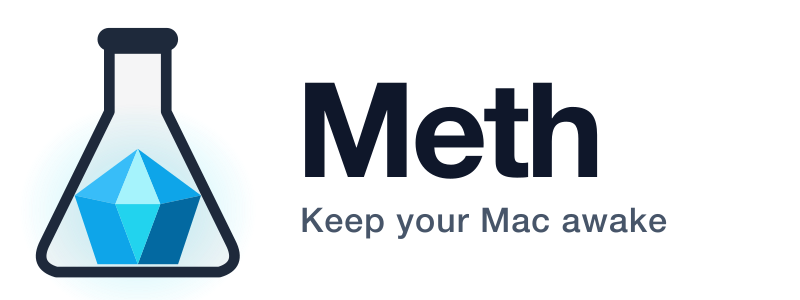
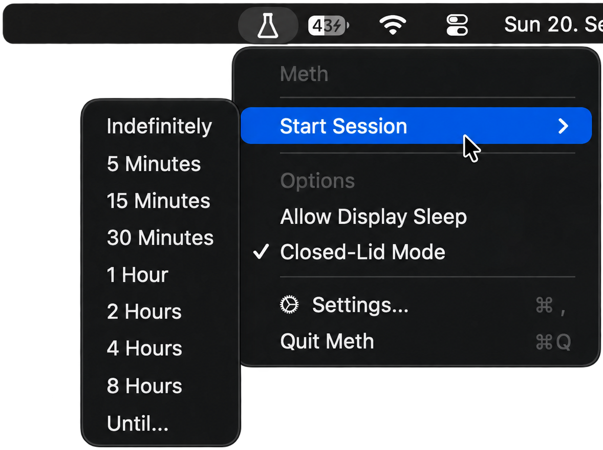

<p align="center">
  <picture>
    <source media="(prefers-color-scheme: dark)" srcset="Assets/rendered/meth-wordmark-dark.png">
    <source media="(prefers-color-scheme: light)" srcset="Assets/rendered/meth-wordmark-light.png">
    
  </picture>
</p>

<p align="center">
  <a href="../../actions/workflows/build.yml"></a>
  <a href="LICENSE"></a>
  
</p>

---

Meth is a lightweight, native macOS menu bar utility for controlling system sleep. Its
defining feature is **Closed-Lid Mode**: ordinary "keep awake" tools only prevent *idle*
sleep, not the sleep macOS triggers when the lid is closed. Meth adds a dedicated,
narrowly-scoped mechanism specifically for that case, so long-running work — builds,
downloads, vibecoding sessions, remote sessions, local servers — can keep running with the lid shut.

<p align="center">
  
</p>

---

## Features

- **Normal Keep Awake sessions** — indefinite, or for a fixed duration (5 minutes up to
  8 hours), using standard IOKit power assertions.
- **Until sessions** — stay awake until a specific clock time (e.g. "Until 23:00").
- **Display sleep control** — optionally let the display sleep on its own schedule while
  the system stays awake.
- **Closed-Lid Mode** — keeps the Mac running with the lid closed, with an automatic
  low-battery safety cutoff and a crash-recovery watchdog (see below).
- **Launch at Login**, backed by `SMAppService`.

### Menu bar icon

The status item is a template image drawn from vector paths, so it stays crisp at any
resolution and follows the system's light/dark appearance and menu highlighting. Its three
states are distinguishable at a glance:

| Icon | Meaning |
| --- | --- |
| Empty flask | No session — your Mac sleeps normally |
| Flask with a crystal | A keep-awake session is running |
| Solid flask | A session is running **with Closed-Lid Mode** |

---

## Closed-Lid Mode

Standard macOS idle-sleep assertions (`kIOPMAssertPreventUserIdleSystemSleep`,
`kIOPMAssertPreventUserIdleDisplaySleep`) and tools built on them, such as `caffeinate`,
do **not** prevent sleep triggered by closing the lid. Overriding that requires a
different, privileged mechanism: the kernel's `SleepDisabled` parameter, toggled via
`pmset -a disablesleep`.

Because this requires administrator privileges, Meth uses the narrowest mechanism that
gets the job done:

- The app itself **never runs as root** and has **no background daemon or helper
  process** that runs continuously.
- Administrator authentication is requested **once**, to install a drop-in `sudoers.d`
  rule that permits only two exact commands, with no wildcards:
  `pmset -a disablesleep 0` and `pmset -a disablesleep 1`.
- After that one-time setup, enabling and disabling Closed-Lid Mode runs those two fixed
  commands via `sudo -n`, with no further prompts.
- Support can be removed at any time from Settings, which restores normal sleep behavior
  first, then removes the rule and verifies both steps succeeded.
- Closed-Lid support cannot be removed while a Closed-Lid session is currently relying on
  it; stop the session first.

**Crash and stale-state recovery.** If Meth is killed unexpectedly, a small independent
watchdog process (spawned only while Closed-Lid Mode is active) detects the exit via a
kernel `kqueue` event and restores normal sleep behavior, retrying a bounded number of
times with backoff and verifying the result. On every launch, Meth also checks for a
`SleepDisabled=1` state left over from an ungraceful shutdown — but only reverts it if
Meth's own records indicate *it* was the one that enabled it. If `SleepDisabled` is
already enabled for some other reason (another tool, or an administrator), Meth leaves it
untouched rather than guessing. Meth attempts to restore normal sleep behavior after
crashes using this watchdog and startup check; it cannot guarantee recovery in every
conceivable failure mode (for example, if the privileged rule itself becomes unusable at
the exact moment recovery is attempted), but every reasonable failure path is covered.

**Thermal and battery safety.** Closed-Lid Mode keeps the CPU, memory, and fans active
with the lid shut, which increases heat and battery use. Meth does not override macOS's
own critical-battery or thermal-emergency behavior, refuses to *start* a Closed-Lid
session while already at 10% or below on battery power, and automatically stops a running
one if the battery drops to that threshold. Never place an actively running, closed
MacBook in an enclosed bag or unventilated space.

---

## Security model

- No generic shell execution and no arbitrary command execution: every privileged
  invocation is a fixed, absolute-path command (`/usr/bin/pmset ...`) run through
  `sudo -n`, never through a shell with interpolated input.
- The sudoers rule is written to a temporary, root-owned file first, validated with
  `visudo -c -f`, and only then atomically renamed into place — it is never written
  through a redirection at its final path.
- No persistent daemon, no XPC service, no login item beyond the app itself.
- No analytics, telemetry, crash reporting, or third-party tracking.
- No network communication of any kind. Meth does not check for updates, phone home, or
  make any outbound connections; the only place a network is involved is when a user
  manually downloads a release from GitHub in their browser.

---

## Installation

1. Download `Meth.zip` from the [**Latest Meth**](../../releases/tag/rolling) release.
2. Unzip it and move `Meth.app` to `/Applications`.
3. Open `Meth.app`. Since development builds are not notarized, the first launch requires
   right-clicking the app and choosing **Open**.
4. To use Closed-Lid Mode, open **Settings → Closed-Lid Support** and click
   **Install Support** to authorize the scoped rule once.

## Uninstallation

- **Remove the app**: quit Meth and delete `Meth.app` from `/Applications`.
- **Remove Closed-Lid support** (optional, if installed): open **Settings → Closed-Lid
  Support** and click **Remove Support** before deleting the app. This restores normal
  sleep behavior and removes the sudoers rule. If you delete the app without doing this
  first, the harmless, narrowly-scoped rule remains on disk (it grants no privilege Meth
  isn't already using) until manually removed:
  `sudo rm /private/etc/sudoers.d/meth-closed-lid`.

---

## Building from source

Requirements: macOS 13.0+, Xcode 15+ (a full Xcode installation, not just the Command
Line Tools, is required to run the test suite — XCTest ships with Xcode).

```bash
git clone https://github.com/BTFLV/Meth.git
cd Meth

# Quick local build for the host architecture only
swift build -c release

# Run the test suite (requires Xcode, not just Command Line Tools)
swift test

# Or build/test via the Xcode project generated by project.yml (XcodeGen)
xcodebuild build -project Meth.xcodeproj -scheme Meth -configuration Release
xcodebuild test -project Meth.xcodeproj -scheme MethTests -destination "platform=macOS"

# Package the distributable, Universal 2 (arm64 + x86_64) dist/Meth.app and dist/Meth.zip
./scripts/build_app.sh
```

`Meth.xcodeproj` is generated from `project.yml` via [XcodeGen](https://github.com/yonaskolb/XcodeGen);
edit `project.yml` and run `xcodegen generate` rather than editing the project directly.

---

## System requirements

- macOS 13.0 (Ventura) or later.
- **Universal 2**: the published `Meth.zip` contains a single `Meth.app` with both Apple
  Silicon (arm64) and Intel (x86_64) binaries; the correct slice is used automatically.
  Intel compatibility is built and packaged but is not actively tested on real Intel
  hardware, since none is available in this project's build environment.
- Administrator authentication (once) only if Closed-Lid Mode is used; ordinary keep-awake
  sessions require no elevated privileges at all.

---

## Development builds

Every push to `main` that builds and tests successfully updates a single, persistent
GitHub Release: **Latest Meth**, tagged `rolling`. Its `Meth.zip` asset is replaced in
place (the same download URL always serves the current build), and the `rolling` tag
always points at the exact commit that produced it.

---

## Brand assets

The logo — an Erlenmeyer flask holding a faceted crystal — lives in
[`Assets/logo`](Assets/logo) as SVG, in light, dark, and full-colour app icon variants.
Everything else is derived from those sources by
[`scripts/generate_logo_assets.sh`](scripts/generate_logo_assets.sh): the README artwork in
`Assets/rendered`, and the app's `AppIcon.icns`. The generated files are committed, so no
build or CI step needs an SVG toolchain; re-run the script only after editing an SVG.

The menu bar glyph is deliberately *not* derived from them — at 16-18 pt it needs its own
weights, so it is drawn directly from vector paths in
[`MenuBarIcon.swift`](Sources/Meth/UI/MenuBarIcon.swift).

---

## License

This project is licensed under the MIT License. See [LICENSE](LICENSE) for details.
